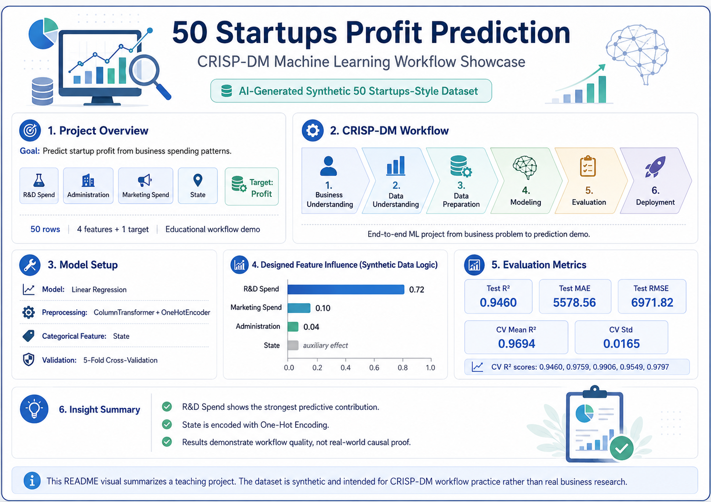
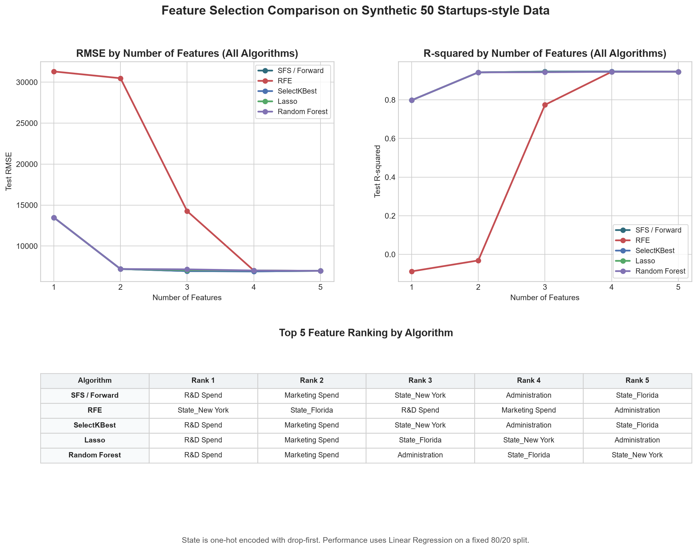
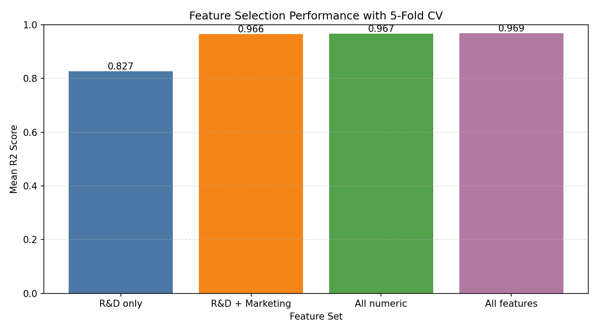

# Synthetic 50 Startups CRISP-DM Startup Profit Prediction

## Project Overview

This project builds a beginner-friendly machine learning regression workflow for predicting startup profit using an AI-generated synthetic 50 Startups-style dataset. The project follows the CRISP-DM methodology and is organized so it can be shared on GitHub as a homework portfolio project.

This project uses an AI-generated synthetic 50 Startups-style dataset for educational CRISP-DM workflow demonstration. The dataset is not used for real business research. The goal is to demonstrate the full machine learning workflow, not to claim real-world causal conclusions.

Technical whitepaper:

- [HW6 Technical Whitepaper](docs/HW6_TECHNICAL_WHITEPAPER.md)

## Dataset

Dataset: AI-generated synthetic 50 Startups-style dataset

The dataset is generated by:

```bash
python src/generate_synthetic_startups.py
```

Generated file path:

```text
data/50_Startups.csv
```

Columns:

- `R&D Spend`
- `Administration`
- `Marketing Spend`
- `State`
- `Profit`

Generation logic:

- `R&D Spend` has the strongest predictive signal in the synthetic formula.
- `Marketing Spend` has a medium predictive signal.
- `Administration` has a smaller predictive signal.
- `State` adds a small location adjustment.
- A small amount of random noise is added.
- A fixed random seed is used so the generated dataset is reproducible.

## CRISP-DM Workflow

This project follows the six CRISP-DM steps:

1. Business Understanding
2. Data Understanding
3. Data Preparation
4. Modeling
5. Evaluation
6. Deployment

The Python script prints progress for each CRISP-DM step and saves model artifacts and plots to the `outputs/` folder.

## Features and Target

Features:

- `R&D Spend`
- `Administration`
- `Marketing Spend`
- `State`

Target:

- `Profit`

The categorical `State` feature is encoded with `OneHotEncoder`. `LabelEncoder` is intentionally not used because state names are nominal categories, not ordered numeric values.

## Model

Model used:

- `LinearRegression`

The workflow uses a scikit-learn `Pipeline` with:

- `ColumnTransformer`
- `OneHotEncoder`
- `LinearRegression`

## Evaluation Metrics

The model is evaluated with:

- R2 Score
- MAE
- RMSE
- 5-fold cross-validation R2 score

Because the dataset has only 50 rows, 5-fold cross-validation is included to provide a more stable estimate of model performance.

## How to Run

1. Create and activate a virtual environment.

```bash
python -m venv .venv
```

On Windows PowerShell:

```powershell
.\.venv\Scripts\Activate.ps1
```

2. Install dependencies.

```bash
pip install -r requirements.txt
```

3. Generate the synthetic dataset.

```bash
python src\generate_synthetic_startups.py
```

4. Run the CRISP-DM machine learning workflow.

```bash
python src\solve_50_startups_crispdm.py
```

5. Run the advanced feature selection comparison.

```bash
python src\feature_selection_comparison.py
```

## Results

After running the scripts, the following files are generated:

- `data/50_Startups.csv`
- `outputs/feature_selection_performance.png`
- `outputs/startup_profit_model.pkl`

Actual model results from the current synthetic dataset:

- Test R2 Score: 0.9460
- Test MAE: 5578.56
- Test RMSE: 6971.82
- 5-fold CV mean R2: 0.9694
- 5-fold CV std: 0.0165

Feature selection performance plot:



These results show that the workflow runs successfully on reproducible synthetic teaching data. They should not be interpreted as real business research findings.

## Advanced Feature Selection Comparison

This project also includes an advanced comparison of five feature selection methods:

- Sequential Forward Selection (SFS / Forward)
- RFE
- SelectKBest
- Lasso
- Random Forest feature importance

The script expands `State` with one-hot encoding and `drop_first=True`, then compares the top 1 through top 5 ranked features for each method using the same Linear Regression model. RMSE and R2 are shown together so the chart can compare both prediction error and explained variance.

```bash
python src\feature_selection_comparison.py
```


In the current synthetic dataset, methods that rank `R&D Spend` and `Marketing Spend` early tend to perform well because those variables were designed to carry strong predictive signal in the synthetic generation formula. This should be interpreted as a feature selection workflow demonstration, not as a causal business conclusion.
